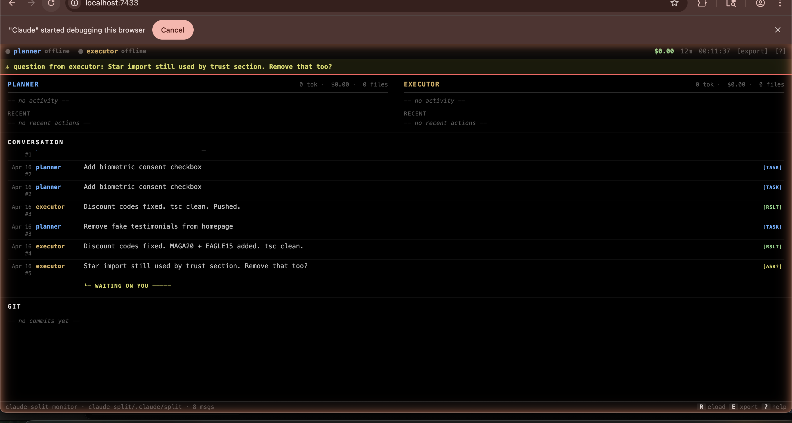

# claude-split-monitor

[](https://pypi.org/project/claude-split-monitor/)
[](https://pypi.org/project/claude-split-monitor/)
[](LICENSE)

**Real-time dashboard for [claude-split](https://github.com/carlos-rdz/claude-split) sessions.**

See what your Planner and Executor agents are doing, how much they're spending, and where your time goes.



> See it in action: [demo.gif](docs/demo.gif) *(record with `claude-split-monitor --no-browser` + any screen-to-gif tool)*

## Features

- **Live agent status** — alive/offline detection via PID scanning
- **Token + cost tracking** — reads session JSONLs, computes `$` spent per agent
- **Task distribution donut** — visual split of work between agents
- **Activity timeline** — 30-slot bars showing message history per agent
- **Message flow log** — chronological event stream
- **Savings banner** — "X tasks faster" or cost delta vs sequential
- **Workload balance bar** — % split between Planner and Executor
- **Live updates** — WebSocket pushes state changes every 2 seconds

## Install

```bash
pip install claude-split-monitor
```

Or from source:

```bash
git clone https://github.com/carlos-rdz/claude-split-monitor
cd claude-split-monitor
pip install -e .
```

## Run

From any repo that has `claude-split` initialized:

```bash
claude-split-monitor
```

Opens at **http://localhost:7433** and auto-launches in your browser.

Skip auto-open:
```bash
claude-split-monitor --no-browser
```

## How It Works

```
┌──────────────────────┐     ┌──────────────────────┐
│ .claude/split/       │     │ ~/.claude/sessions/  │
│  inbox-planner.md    │     │  {pid-data}.json     │
│  inbox-executor.md   │     │ ~/.claude/projects/  │
└──────────┬───────────┘     │  {cwd}/*.jsonl       │
           │                 └──────────┬───────────┘
           │                            │
           ▼                            ▼
     ┌──────────────────────────────────────┐
     │   claude-split-monitor server.py     │
     │   Polls every 2s, parses, enriches   │
     └─────────────────┬────────────────────┘
                       │  WebSocket push
                       ▼
              ┌────────────────┐
              │  dashboard.html │
              │  (your browser) │
              └────────────────┘
```

The server watches two things:

1. **Inbox files** — the source of truth for task state (pending, done, type, priority)
2. **Session JSONLs** — live Claude Code sessions for token/cost/activity data

## Endpoints

| Endpoint | Description |
|----------|-------------|
| `GET /` | Dashboard HTML |
| `GET /api/state` | Full JSON state (same as WebSocket) |
| `GET /api/health` | Server + session health check |
| `WS /ws` | Live state updates on change |

### State Shape

```json
{
  "type": "cowork_state",
  "status": "active",
  "planner": {
    "pending": [...],
    "done": [...],
    "alive": true,
    "tokens_in": 42000,
    "tokens_out": 15000,
    "cost_usd": 0.35,
    "activity": ["thinking", "edit", "tool", ...]
  },
  "executor": { "...same shape..." },
  "flow": [
    { "id": "MSG-20260416-001", "time": "Apr 16 #1",
      "from": "planner", "to": "executor",
      "type": "task", "body": "...", "acked": true }
  ],
  "totals": {
    "messages": 8,
    "pending": 3,
    "done": 5,
    "total_cost": 0.72,
    "uptime_s": 3600,
    "sequential_estimate": 1.44
  },
  "planner_alive": true,
  "executor_alive": true
}
```

## Model Pricing

Cost is estimated using these rates per 1M tokens:

| Model | Input | Output |
|-------|-------|--------|
| Opus | $15 | $75 |
| Sonnet | $3 | $15 |
| Haiku | $0.25 | $1.25 |

Default fallback: Sonnet pricing.

## Requirements

- Python 3.8+
- `websockets` >= 14
- A repo with [claude-split](https://github.com/carlos-rdz/claude-split) initialized

## License

MIT
